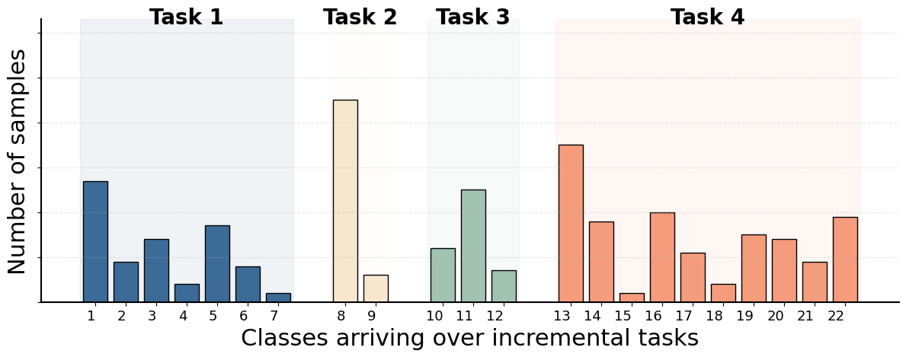
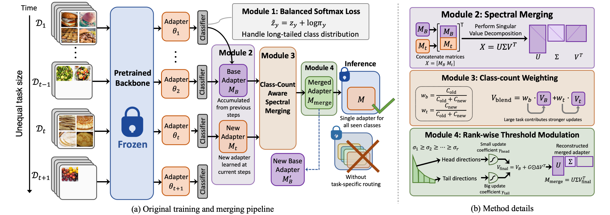

# Dual-Imbalance-aware Adapter Merging for Continual Food Recognition

<p align="center">
    <a href="https://arxiv.org/pdf/xxxx">
            
    </a>
</p>

This repository provides the official PyTorch implementation of **DIME**, a parameter-efficient continual learning framework for real-world food recognition under **dual imbalance** — long-tailed class distributions combined with step-imbalanced task sizes.


---

## Overview

Real-world food recognition naturally exhibits two forms of imbalance:
- **Class imbalance**: a small number of popular food categories dominate the dataset while many others are rare (long-tailed distribution).
- **Step imbalance**: the number of new food classes introduced at each incremental learning step varies significantly across steps.

<p align="center"></p>


Existing continual learning methods typically assume balanced task structures, which deviate from real dietary data streams. DIME addresses both imbalances simultaneously through:

1. **Balanced Softmax training** — counters long-tailed class distributions within each task.
2. **Class-Count Aware Spectral Merging** — integrates new adapters via SVD alignment, weighting contributions by class counts across steps.
3. **Rank-Wise Threshold Modulation** — selectively preserves dominant visual knowledge while allowing flexible updates from small tasks.

DIME maintains a **single merged adapter** for inference, achieving competitive efficiency while consistently outperforming strong baselines by more than 3%.

<p align="center"></p>

---

## Datasets

We evaluate on four long-tailed food recognition benchmarks under step-imbalanced protocols. The datasets are available at: **[Google Drive link — coming soon]**

| Dataset | Description | Classes |
|---|---|---|
| **VFN186-LT** | Visual Food Recognition benchmark with long-tailed distribution reflecting general dietary patterns | 186 |
| **VFN186-Insulin** | Population-specific variant capturing dietary patterns of insulin-dependent individuals | 186 |
| **VFN186-T2D** | Population-specific variant for Type 2 Diabetes dietary patterns | 186 |
| **Food101-LT** | Long-tailed variant of the widely used Food101 benchmark | 101 |

The VFN series datasets are from [He et al., 2023] and reflect real-world dietary consumption patterns across different health conditions and user groups. Food101-LT is derived from the original Food101 dataset by applying a long-tailed sampling procedure.

After downloading, place the datasets under the `data/` directory.

---

## Environment

```bash
conda env create -f environment.yaml
conda activate dime
```

---

## Running Experiments

After setting the dataset paths in the config files under `exps/`, launch training with:

```bash
python main.py --config=./exps/[config].json
```

Available configs:

| Config | Dataset |
|---|---|
| `exps/vfn186.json` | VFN186-LT |
| `exps/vfn186_ins.json` | VFN186-Insulin |
| `exps/vfn186_t2d.json` | VFN186-T2D |
| `exps/food101.json` | Food101-LT |

Key hyperparameters in each config:

| Parameter | Description |
|---|---|
| `task_imb_factor` | Step imbalance ratio ρ (e.g., 0.01, 0.001) |
| `nb_tasks` | Number of incremental steps T |
| `ffn_num` | Adapter hidden dimension (default: 64) |
| `rb_r_head_frac` | Fraction of singular directions treated as "head" in rank-wise modulation |
| `rb_rho_head` / `rb_rho_tail` | Update coefficients for head/tail singular directions |

You can also use the provided training script:

```bash
bash train.sh
```

---

## Results

DIME achieves state-of-the-art performance on all four benchmarks under step-imbalanced settings (ρ = 0.01, T = 10):

| Dataset | A_T | Avg. Acc. | wAvg. Acc. |
|---|---|---|---|
| VFN186-LT | **69.07** | **76.58** | **75.55** |
| VFN186-Insulin | **69.40** | **77.00** | **75.93** |
| VFN186-T2D | **69.88** | **77.48** | **76.47** |
| Food101-LT | **77.01** | **84.10** | **83.77** |

---

## Acknowledgement

We would like to thank [PILOT: A Pre-Trained Model-Based Continual Learning Toolbox](https://github.com/sun-hailong/LAMDA-PILOT) for providing the overall training pipeline on which this work is built.

---

## Citation

If you find this work useful for your research, please consider citing our paper:

```bibtex
@inproceedings{zhang2026dime,
  title     = {Dual-Imbalance Continual Learning for Real-World Food Recognition},
  author    = {Zhang, Xiaoyan and He, Jiangpeng},
  booktitle = {Proceedings of the IEEE/CVF Conference on Computer Vision and Pattern Recognition Workshops},
  year      = {2026}
}
```
